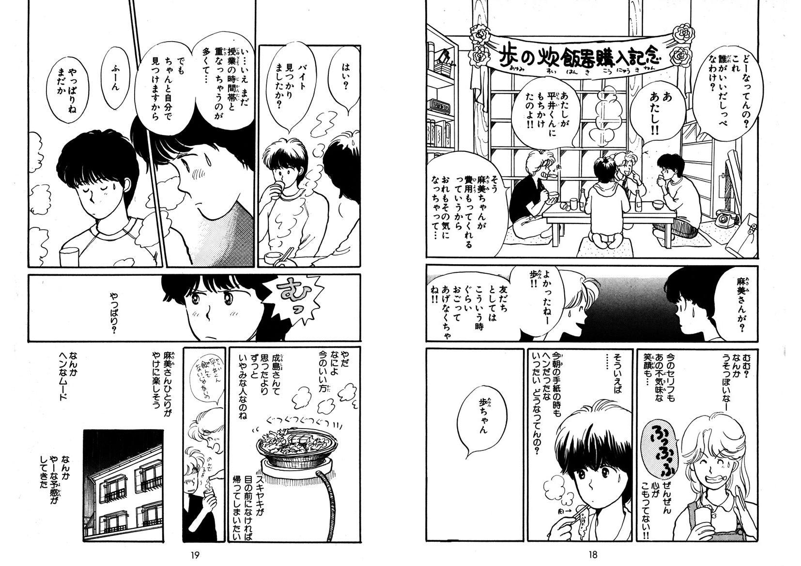
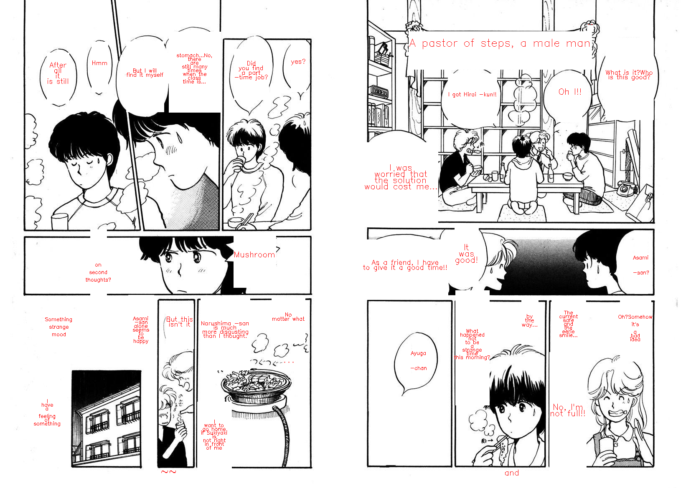
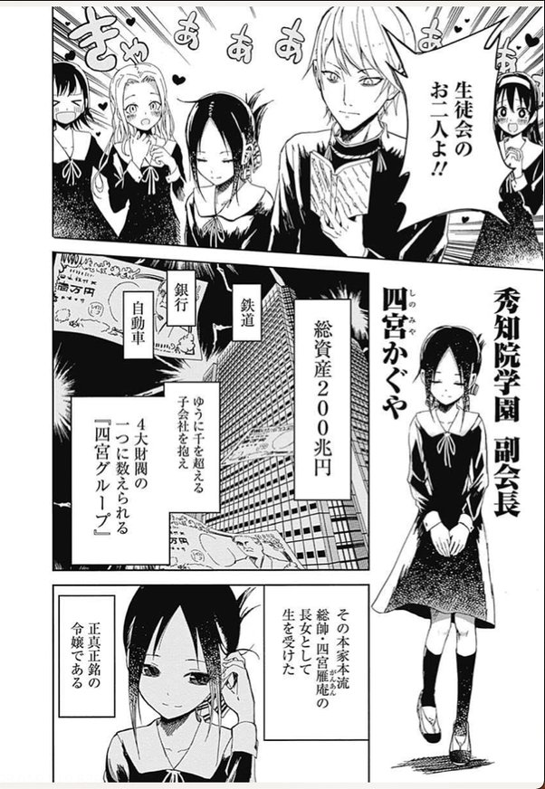
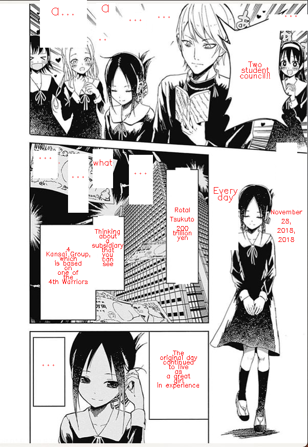

# What is the project

This is a project aimed at automatically translating Japanese manga scan images to English. This project is created for fun and as a personal challenge, with the goal of replacing the Japanese text bubbles with English boxes. Although the results are not perfect and there are issues with translations, the project serves as a starting point for exploring the possibilities of automatic translation.

The project utilizes various models and instruments for extracting Japanese characters and performing translations, bringing together a variety of research on Japanese manga scans into an auto-translator. Please note that the alignment of text and boxes may not be perfect, but this project serves as a foundation for further improvements in this area.

I hope this project will inspire others to experiment with manga translation and contribute to the growing community of manga enthusiasts.

# Results

### Image n°1:






### Image n°2




# How is it working

* Work with the [Manga Text Segmentation](https://github.com/juvian/Manga-Text-Segmentation) notebook to get only the text
* Draw and get positions of boxes around each text blocks
* Get japanese characters via [Manga OCR](https://github.com/kha-white/manga-ocr)
* Translate these characters into english with [Google Translate python module](https://pypi.org/project/googletrans/)
* Write the translations related to each boxes
* Overlap the original image and the layer with new boxes 

If you want to try, first, run `Manga_Text_Segmentation_Predict.ipynb` to generate `only_text.png`.
Then, run `notebook.ipynb` to generate the `final_result.png` image. 

# Dependencies

***Warning**: There are multiple conflicts between the dependencies of the first and second notebook. Don't forget to have different python virtual env.*

### Dependencies for `Manga_Text_Segmentation_Predict.ipynb`

Just follow the notebook blocks

### Dependencies for `notebook.ipynb`

```txt
opencv-contrib-python==4.5.5.62
opencv-python==4.7.0.72
googletrans==4.0.0rc1
manga-ocr==0.1.8
numpy==1.22.4
scikit-image==0.20.0
torch==2.0.0
```

*For Ubuntu systems:*
```
sudo apt-get install -y libgtk2.0-dev pkg-config
```


# References

* [Manga Text Segmentation](https://github.com/juvian/Manga-Text-Segmentation)

```
@InProceedings{10.1007/978-3-030-67070-2_38,
    author="Del Gobbo, Juli{\'a}n
    and Matuk Herrera, Rosana",
    editor="Bartoli, Adrien
    and Fusiello, Andrea",
    title="Unconstrained Text Detection in Manga: A New Dataset and Baseline",
    booktitle="Computer Vision -- ECCV 2020 Workshops",
    year="2020",
    publisher="Springer International Publishing",
    address="Cham",
    pages="629--646",
    abstract="The detection and recognition of unconstrained text is an open problem in research. Text in comic books has unusual styles that raise many challenges for text detection. This work aims to binarize text in a comic genre with highly sophisticated text styles: Japanese manga. To overcome the lack of a manga dataset with text annotations at a pixel level, we create our own. To improve the evaluation and search of an optimal model, in addition to standard metrics in binarization, we implement other special metrics. Using these resources, we designed and evaluated a deep network model, outperforming current methods for text binarization in manga in most metrics.",
    isbn="978-3-030-67070-2"
}

@dataset{segmentation_manga_dataset,
  author       = {julian del gobbo and
                  Rosana Matuk Herrera},
  title        = {{Mask Dataset for: Unconstrained Text Detection in 
                   Manga: a New Dataset and Baseline}},
  month        = feb,
  year         = 2021,
  publisher    = {Zenodo},
  version      = {1.0},
  doi          = {10.5281/zenodo.4511796},
  url          = {https://doi.org/10.5281/zenodo.4511796}
}
```

* [Manga OCR](https://github.com/kha-white/manga-ocr)

* [Google Translate python module](https://pypi.org/project/googletrans/)